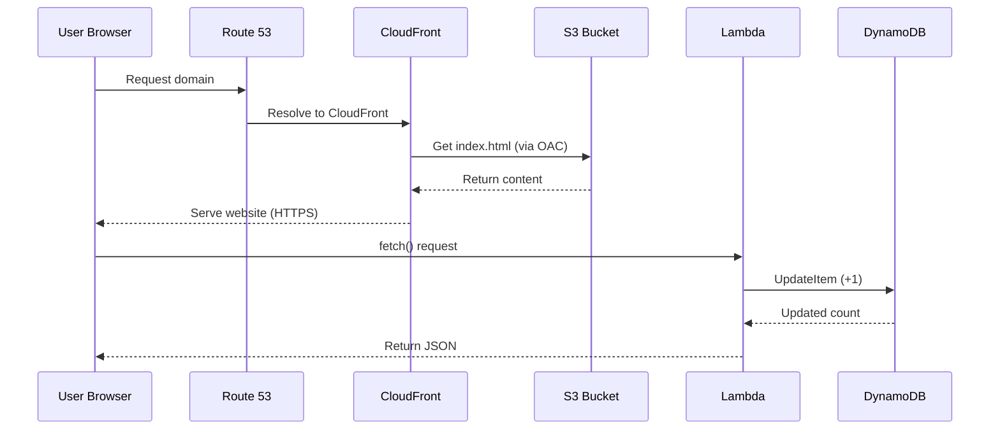

# 🚀 Cloud Resume Challenge (AWS)

A **production-style, serverless resume website** built on AWS using **Infrastructure as Code (Terraform)** and automated with **CI/CD (GitHub Actions)**.

> ⚠️ **Status:** Infrastructure has been intentionally torn down to optimize AWS costs.
> The entire environment is **fully reproducible** using Terraform.

---

# 🏗️ Architecture Overview

```mermaid
graph TD

A[User Browser] --> B[Route 53]
B --> C[CloudFront (HTTPS + ACM)]
C --> D[S3 Bucket (Private)]
C -.->|OAC| D

A -->|API Call| E[Lambda Function URL]
E --> F[Lambda Function]
F -->|Atomic Update| G[DynamoDB - View Counter]

subgraph AWS (Provisioned via Terraform)
B
C
D
F
G
end
```

---

# 🔄 Request Flow (Frontend + API)



---

# ⚙️ CI/CD Pipeline

```mermaid
graph TD

A[Developer Push to GitHub] --> B[GitHub Actions]

B --> C[Frontend Pipeline]
B --> D[Backend Pipeline]

C -->|Upload Static Files| E[S3 Bucket]

D -->|Run Tests (Pytest + Moto)| F[Terraform Apply]
F --> G[AWS Infrastructure Updated]

subgraph CI/CD
B
C
D
end
```

---

# ⚙️ Architecture Breakdown

## 🌐 Frontend & Delivery

* **Amazon S3**: Hosts static HTML/CSS/JS
* **Amazon CloudFront**: HTTPS + global CDN
* **Amazon Route 53**: DNS routing

## 🔐 Security Layer

* **Origin Access Control (OAC)** ensures S3 is private
* HTTPS enforced via ACM
* No direct public S3 access

## ⚡ Serverless Backend

* **AWS Lambda (Python)** via Function URL
* Handles API calls from frontend
* Performs atomic counter updates

## 🗄️ Database

* **Amazon DynamoDB**
* Uses atomic `UpdateItem` to avoid race conditions

## 🔁 CI/CD

* **GitHub Actions**

### Frontend Pipeline

* Syncs HTML/CSS/JS → S3

### Backend Pipeline

* Runs unit tests (Pytest + Moto)
* Executes Terraform for infra updates

## 🏗️ Infrastructure as Code

* Fully provisioned using **Terraform**
* Version-controlled and reproducible

---

# 🚀 Key Features

* **Infrastructure as Code**
  Fully automated AWS provisioning with Terraform

* **Serverless Architecture**
  Lambda + DynamoDB backend

* **Atomic Data Handling**
  Safe concurrent updates using DynamoDB

* **Secure Delivery**
  Private S3 + CloudFront OAC + HTTPS

* **CI/CD Automation**
  End-to-end deployment pipelines

---

# ⚡ System Design Highlights

* **CDN Optimization:** CloudFront edge caching for low latency
* **Atomic Operations:** DynamoDB ensures consistency under load
* **Automation:** Terraform enables reproducible environments
* **Separation of Concerns:** Frontend, backend, infra clearly separated

---

# 🛠️ Technical Challenges & Solutions

## 1. CloudFront 403 (OAC)

**Problem:**
AccessDenied errors due to incorrect OAC + bucket policy

**Solution:**
Used `AWS:SourceArn` condition to restrict access to specific CloudFront distribution

---

## 2. Terraform State Issues

**Problem:**
`EntityAlreadyExists` due to manual changes

**Solution:**

* Cleaned AWS resources
* Used `terraform import` to sync state

---

## 3. CORS Errors

**Problem:**
Frontend couldn’t call Lambda

**Solution:**
Configured allowed origins and headers in Terraform

---

# 📂 Project Structure

```bash
.
├── .github/workflows/
│   ├── frontend-cicd.yml
│   └── backend-cicd.yml
├── IaC/
│   ├── main.tf
│   └── provider.tf
├── website/
│   ├── index.html
│   ├── styles.css
│   └── script.js
└── lambda/
    ├── func.py
    └── test_lambda.py
```

---

# 📈 Lessons Learned

* **Cost Optimization:** Learned AWS billing and teardown strategies
* **Testing:** Mocked AWS services using Moto
* **Debugging:** Solved DNS, IAM, and CloudFront issues

---

# 🧠 Future Improvements

* Add authentication (Cognito / JWT)
* Add monitoring (CloudWatch dashboards)
* Introduce API Gateway
* Add logging + tracing (X-Ray)

---

# 📌 Key Takeaway

This project demonstrates:

* Cloud architecture design
* Terraform-based automation
* Serverless application development
* CI/CD implementation

---

> 💡 This is a **production-style cloud system**, not just a tutorial project.
