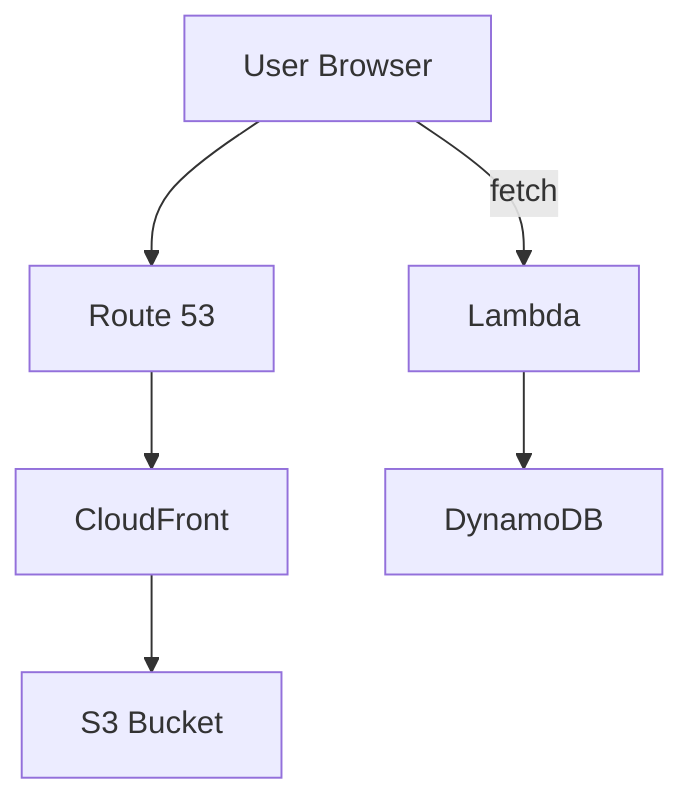
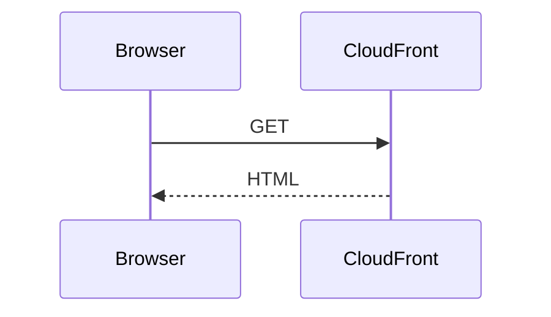

# 🚀 Cloud Resume Challenge (AWS)

A **production-style, serverless resume website** built on AWS using **Infrastructure as Code (Terraform)** and automated with **CI/CD (GitHub Actions)**.

> ⚠️ **Status:** Infrastructure has been intentionally torn down to optimize AWS costs.
> The entire environment is **fully reproducible** using the provided Terraform configurations.

---

# 🏗️ Architecture Overview

# 🏗️ Architecture Overview



# ⚙️ Architecture Breakdown

Some text here...

## Another section


# ⚙️ Architecture Breakdown

## 🌐 Frontend & Delivery

* **Amazon S3**: Hosts static HTML/CSS/JS files.
* **Amazon CloudFront**: Provides HTTPS delivery and global edge caching.
* **Amazon Route 53**: Manages DNS and routes traffic to CloudFront.

## 🔐 Security Layer

* Implemented **Origin Access Control (OAC)** to keep the S3 bucket private.
* Enforced HTTPS using AWS Certificate Manager (ACM).
* Restricted direct public access to S3.

## ⚡ Serverless Backend

* **AWS Lambda (Python)** exposed via Function URL.
* Handles API requests from frontend (`fetch()` call).
* Performs atomic updates to visitor count.

## 🗄️ Database

* **Amazon DynamoDB**
* Uses `UpdateItem` with atomic increment to safely handle concurrent requests.

## 🔁 CI/CD Pipelines

* **GitHub Actions** automates deployments:

### Frontend Pipeline

* Syncs static files to S3 on every push.

### Backend Pipeline

* Runs Python unit tests (Pytest + Moto).
* Executes `terraform apply` for infrastructure updates.

## 🏗️ Infrastructure as Code

* Entire AWS stack provisioned using **Terraform**
* Modular, version-controlled, and reproducible setup

---

# 🚀 Key Features

* **Infrastructure as Code**
  Fully automated AWS provisioning using Terraform for consistent environments.

* **Serverless Architecture**
  Event-driven backend using Lambda + DynamoDB.

* **Atomic Data Handling**
  DynamoDB `UpdateExpression` ensures accurate visitor counts under concurrency.

* **Secure Content Delivery**
  Private S3 bucket enforced via CloudFront OAC and HTTPS.

* **CI/CD Automation**
  GitHub Actions pipelines for both frontend and backend deployments.

---

# ⚡ System Design Highlights

* **CDN Optimization:** Leveraged CloudFront edge locations for low-latency global delivery.
* **Atomic Operations:** Ensured data consistency using DynamoDB atomic updates.
* **Infrastructure Automation:** Fully reproducible environment via Terraform.
* **Separation of Concerns:** Clean separation between frontend, backend, and infrastructure layers.

---

# 🛠️ Technical Challenges & Solutions

## 1. CloudFront 403 (OAC Configuration)

**Problem:**
Persistent `AccessDenied` errors due to misconfigured Origin Access Control and bucket policy.

**Solution:**
Aligned S3 bucket policy with CloudFront OAC using `AWS:SourceArn`, ensuring only the specific distribution could access the bucket.

---

## 2. Terraform State Desynchronization

**Problem:**
Encountered `EntityAlreadyExists` errors due to manual resource changes outside Terraform.

**Solution:**

* Cleaned up resources manually in AWS Console
* Used `terraform import` to restore state consistency

---

## 3. CORS Configuration

**Problem:**
Frontend failed to fetch API due to CORS restrictions.

**Solution:**
Configured Lambda Function URL with allowed origins, headers, and methods via Terraform.

---

# 📂 Project Structure

```bash
.
├── .github/workflows/
│   ├── frontend-cicd.yml
│   └── backend-cicd.yml
├── IaC/
│   ├── main.tf
│   └── provider.tf
├── website/
│   ├── index.html
│   ├── styles.css
│   └── script.js
└── lambda/
    ├── func.py
    └── test_lambda.py
```

---

# 📈 Lessons Learned

* **Cost Awareness:**
  Gained hands-on experience managing AWS billing and optimizing resource usage.

* **Testing Strategy:**
  Used Moto to mock AWS services for unit testing without incurring costs.

* **Real-World Debugging:**
  Resolved DNS, CloudFront, and IAM-related issues during deployment.

---

# 🧠 Future Improvements

* Add authentication layer (Cognito / JWT)
* Implement monitoring (CloudWatch dashboards + alarms)
* Introduce API Gateway for advanced routing and security
* Add logging + tracing (X-Ray)

---

# 📌 Key Takeaway

This project demonstrates the ability to:

* Design **secure, scalable cloud architecture**
* Automate infrastructure using **Terraform**
* Build and deploy **serverless applications**
* Implement **CI/CD pipelines in a real-world environment**

---

> 💡 This is not just a project — it’s a **production-style cloud system built from scratch**.
